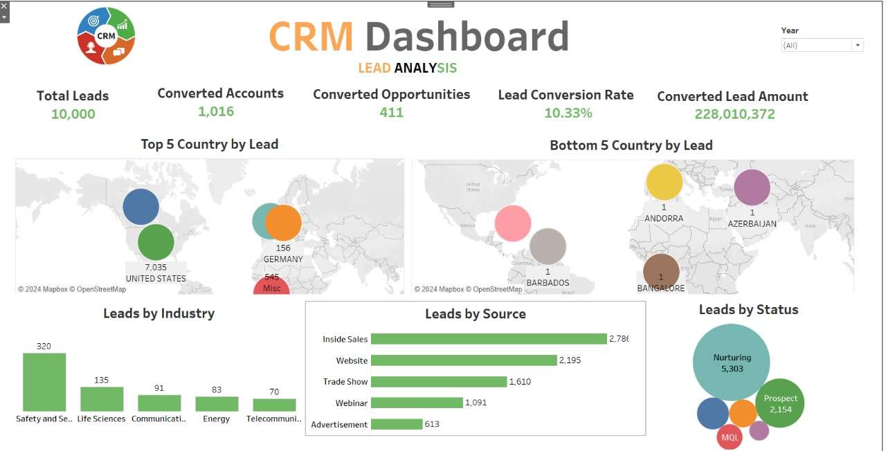
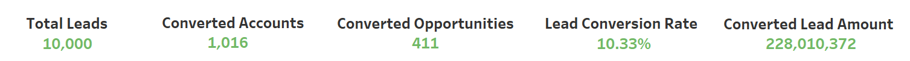
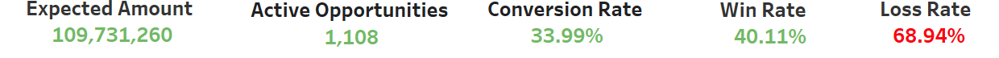
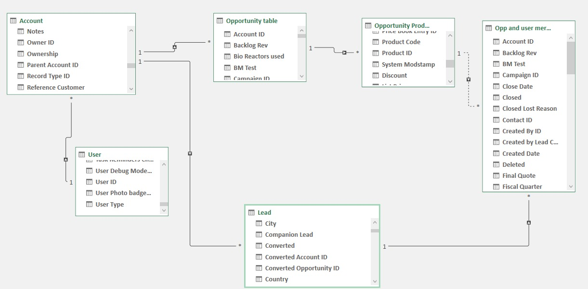
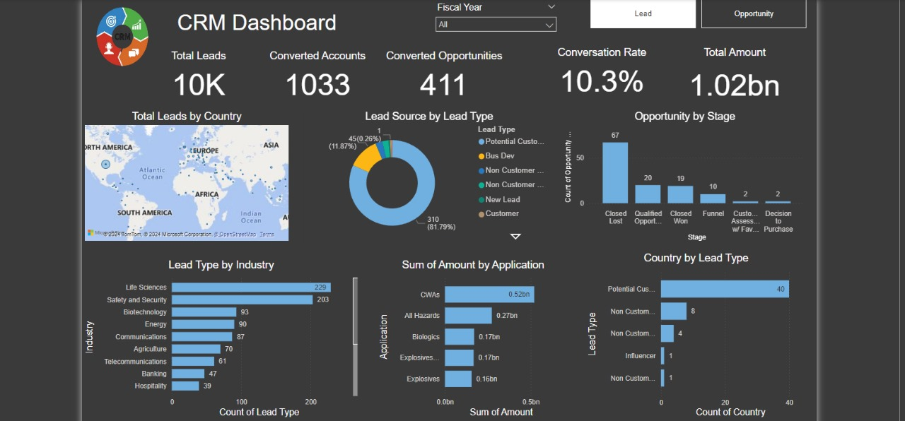
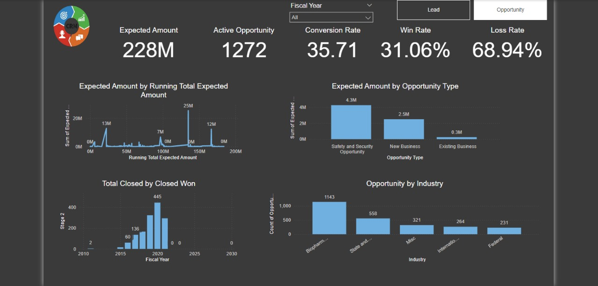
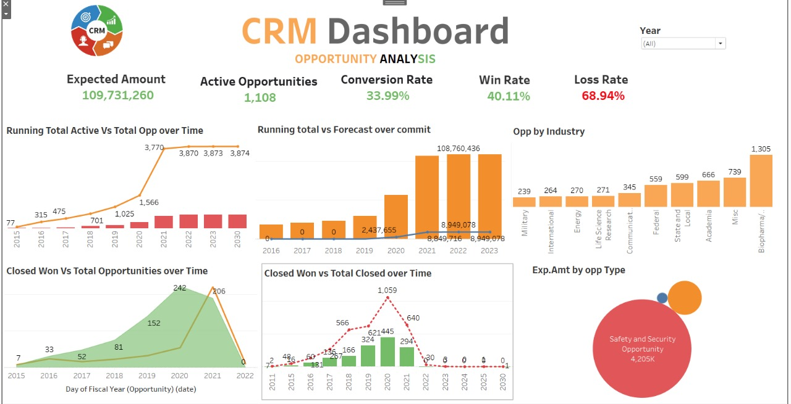

  

# CRM Analysis

This repository contains a comprehensive analysis of **Customer Relationship Management (CRM)** data using various tools like Excel, SQL, Power BI, and Tableau. The analysis was performed by **Group 4** to help businesses optimize their CRM processes, enhance customer interactions, and improve sales strategies through data-driven insights.
## Table of Contents

- [Introduction](#introduction)
- [Yearly Performance Overview](#yearly-performance-overview)
- [Lead Generation and Conversion Analysis](#lead-generation-and-conversion-analysis)
- [KPI Analysis](#kpi-analysis)
- [Data Modeling with Excel](#data-modeling-with-excel)
- [Data Validation and SQL Usage](#data-validation-and-sql-usage)
- [Visualization with Power BI](#visualization-with-power-bi)
- [Visualization with Tableau](#visualization-with-tableau)
- [Key Insights](#key-insights)
- [Strategic Recommendations](#strategic-recommendations)
- [Conclusion](#conclusion)

## Introduction

Customer Relationship Management (CRM) analytics involves gathering, analyzing, and interpreting customer data to extract meaningful insights. These insights help businesses optimize sales, marketing, and customer service efforts, ultimately leading to improved customer satisfaction and business growth.

This analysis aims to understand various aspects of CRM data, including lead generation, conversion rates, opportunity management, and sales performance over time.

## Yearly Performance Overview

The yearly performance metrics provide insights into:
- **Yearly Revenue**: Analyzing business growth and the impact of sales strategies on performance.
- **Lead Generation**: Tracking the effectiveness of lead acquisition strategies over the years.

These metrics allow businesses to evaluate and adjust their approaches for continuous improvement.

## Lead Generation and Conversion Analysis

This section focuses on understanding the quality and quantity of leads:
- **Lead Analysis**: Analyzing the sources of leads such as website visits, referrals, and marketing campaigns to identify trends and optimize strategies.
- **Lead Conversion Rate**: Tracking the percentage of leads that convert into customers, along with trends that affect conversion success.
- **Opportunity Analysis**: Evaluating potential sales in the pipeline, win rates, and the overall value of opportunities to prioritize high-value deals.

## KPI Analysis

Key Performance Indicators (KPIs) provide a snapshot of how the CRM strategy is performing:
- **Total Leads**: 10,000 leads were generated this year.
- **Converted Accounts**: 1,005 leads were successfully turned into customer accounts.
- **Lead Conversion Rate**: 10.53% of leads were converted into customers.
- **Revenue from Converted Leads**: $220,013.72 in revenue generated from converted leads.
- **Opportunity KPIs**: Includes expected revenue ($10.7 million), active opportunities, conversion rate (33.99%), and win/loss rates.

## Data Modeling with Excel

Excel was used to model CRM data for:
- **Quick Data Summarization**: Pivot tables were used to summarize large datasets quickly, allowing for easy trend spotting.
- **Data Comparisons**: Data was broken down by business type, lead source, and opportunity status for easy comparisons.
- **Data Exploration**: Interactive exploration of data without altering the raw dataset, allowing for flexible analysis.

## Data Validation and SQL Usage

- **Data Transformation and Cleansing**: SQL was used to transform raw CRM data into a format suitable for analysis. This included merging data from multiple sources and creating calculated fields.
- **Data Integrity**: SQL joins were designed to ensure accuracy, consistency, and security in data retrieval. This process involved implementing validation rules to maintain precise and reliable data.

## Visualization with Power BI

Power BI was utilized to visualize the CRM data, providing key insights:
- **Total Leads by Country**: North America had the majority of leads, while Africa, Asia, and South America were under-penetrated regions.
- **Lead Type by Industry**: Life Sciences and Safety & Security were the leading industries in terms of leads, while Banking and Hospitality had lower engagement.
- **Lead Source by Lead Type**: Most leads came from new opportunities (81.79%), indicating a strong inflow of fresh leads.

## Visualization with Tableau

Tableau was used to visualize trends over time:
- **Running Total of Active Opportunities**: Active opportunities increased significantly from 2018 to 2020 but plateaued afterward.
- **Closed Won vs Total Closed**: Steady growth from 2016 to 2020 in closed-won deals, followed by a sharp decline after 2020.
- **Running Total vs. Forecast**: Forecasted opportunities peaked in 2021, with stable expectations from 2021 to 2023.

## Key Insights

- **Growth Plateau**: Post-2020, opportunity growth plateaued, suggesting market saturation or a shift in business conditions.
- **Regional Insights**: North America dominates lead generation, while Africa, Asia, and South America are under-exploited markets.
- **Lead Utilization**: New leads are abundant, but potential customers are underutilized, presenting an opportunity to improve conversion strategies.
- **Industry Focus**: Biopharmaceuticals and Safety & Security sectors are leaders in opportunity generation.

## Strategic Recommendations

- **Expand into Untapped Markets**: Focus efforts on under-represented regions like Africa, Asia, and South America to capture new leads.
- **Improve Lead Conversion**: Develop more effective strategies to convert potential customers into sales.
- **Diversify Focus**: Broaden CRM strategies beyond high-value areas to mitigate risk and capture more market share.
- **Revise Sales Strategies**: Adjust sales strategies to counter the post-2020 decline in closed-won opportunities.

## Conclusion

CRM analytics is a critical tool for improving decision-making, customer satisfaction, and business growth. This analysis provides insights into how businesses can optimize sales processes, capture new opportunities, and respond to market changes. Moving forward, integrating advanced technologies like artificial intelligence and machine learning into CRM systems can further enhance predictive capabilities and drive continuous innovation.

---

This **CRM Analysis** repository will be continually updated with new insights and tools to improve CRM strategies and business outcomes.

## License

This project is licensed under the MIT License - see the [LICENSE](./LICENSE) file for details.
